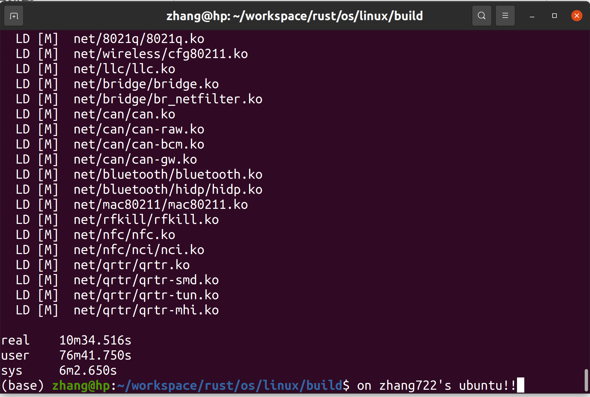
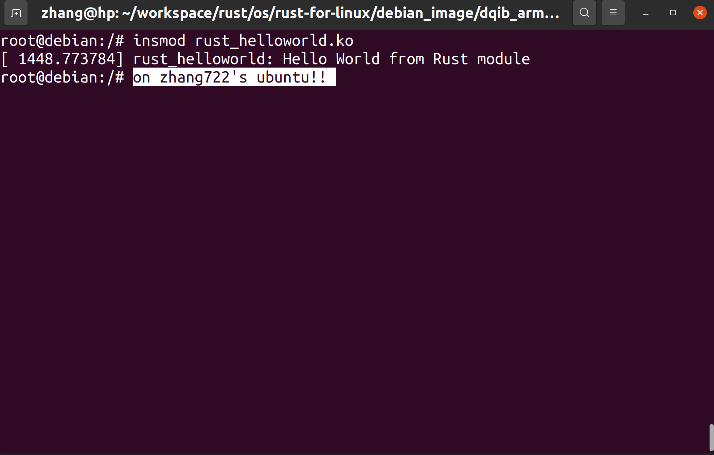
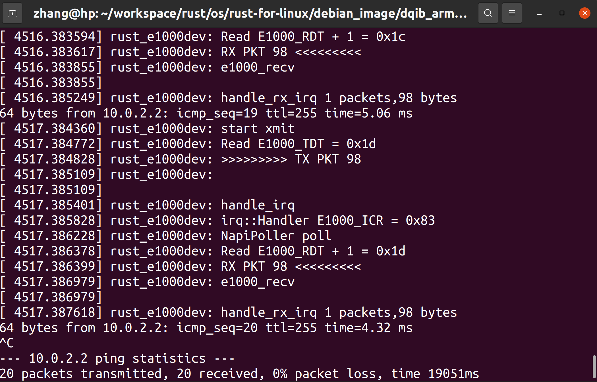

## 仓库：
1. [rust-for-linux](https://github.com/zhang722/linux)
2. [e1000-driver](https://github.com/zhang722/e1000-driver)

## exercise1
1. 安装llvm
2. 拉取仓库并配置
拉取rust-e1000分支：
```
git clone -b rust-e1000 https://github.com/zhang722/linux --depth=1
```
然后
```
make ARCH=arm64 LLVM=1 O=build defconfig
make ARCH=arm64 LLVM=1 O=build menuconfig
```
选中Rust Support和Rust Samples，搜索e1000，按数字键跳转到选项，去掉e1000驱动，然后编译
```
cd build
make ARCH=arm64 LLVM=1 -j8
```
3. 运行截图



## exercise2
1. 编写内核模块代码
2. 在rust/samples下的Makefile里加入
```
obj-$(CONFIG_SAMPLE_RUST_HELLOWORLD)        += rust_helloworld.o
```
3. 在Kconfig里加入
```
config SAMPLE_RUST_HELLOWORLD
	tristate "Print Helloworld in Rust"
	help
		This option builds the Rust HelloWorld module sample.
		
		To compile this as a module, choose M here:
		the module will be called rust_helloworld.
		
		If unsure, say N.
```
4. 回到linux目录，重新配置
```
make ARCH=arm64 LLVM=1 O=build menuconfig
```
把Rust Samples里Print Helloworld in Rust选项勾选上，然后重新编译
5. 运行结果


## exercise3 & exercise4
1. 编写驱动代码并编译
2. 将驱动复制到debian文件系统镜像内
   1. 在解压的debian文件夹新建copy_ko.sh
    ```
    sudo modprobe nbd max_part=12
    sudo env "PATH=$PATH" qemu-nbd --connect=/dev/nbd0 image.qcow2
    sudo mount /dev/nbd0p1 /mnt/test/
    sudo cp /home/zhang/workspace/rust/os/rust-for-linux/e1000-driver/src/e1000_for_linux.ko /mnt/test/e1000_for_linux.ko
    sudo umount /mnt/test
    sudo env "PATH=$PATH" qemu-nbd --disconnect /dev/nbd0
    sudo modprobe -r nbd
    ```
   2. 在debian文件夹新建run_qemu.sh
    ```
    qemu-system-aarch64 -machine 'virt' \
        -cpu 'cortex-a57' \
        -m 1G \
        -device virtio-blk-device,drive=hd \
        -drive file=image.qcow2,if=none,id=hd \
        -device virtio-net-device,netdev=net \
        -netdev user,id=net,hostfwd=tcp::2222-:22 \
        -kernel /home/zhang/workspace/rust/os/rust-for-linux/linux/build/arch/arm64/boot/Image.gz \
        -initrd initrd -nographic -append "root=LABEL=rootfs console=ttyAMA0" \
        -device e1000,netdev=net0,bus=pcie.0 -netdev user,id=net0
    ```
3. 安装模块、启动e1000网卡、ping网关



